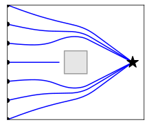
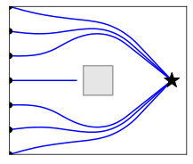
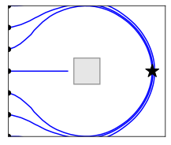
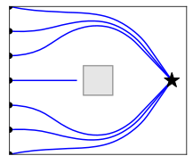
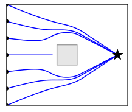

# Fast Obstacle Avoidance for Dynamic Environments
---
[](http://unlicense.org/)
[](https://github.com/ambv/black)
---

## Introduction
This work describes a Fast Obstacles Avoidance (FOA) which can be used, when the known input data is sampled (unstructured), or in the presence of many obstacles.
The algorithm is able to input sampled data, as well as a desired velocity, and outputs the collision free velocity.

<p align="center">
</>

Since the input to the algorithm is raw sensor data (in the cartesian frame), it can directly be applied to an arbitrary number of data points. 
<p align="center">
</>

Improved performance can be achieved by first clustering the datapoints with commonly used techniques, here we use DBSCAN.
<p align="center">
</>

A video describing the algorithm in depth can be found under:     
[](https://youtu.be/kr7R_cJoaYI)


### Controller Parameters
The algorithm has several free parameters which can be tuned to adapt the performance based on the environment.

The distance for each data point $o$ is calculated as follows:

$$ 
 \Gamma_o(\xi) = \| \xi - \xi_o \| / R_0
$$

where $R_0$ is the control radius, which accounts for the robots geometry.

Crucial is for the function of the algorithm is the  influence weight that each point $o$ has on the agent. This is calculated with this formula:

$$ 	 
\hat{w}_o(\xi) = \left( \frac{D^{\mathrm{scal}}}{D_o(\xi)} \right)^s
	\qquad \text{with} \quad
	D_o (\xi) = \Gamma_o(\xi) - 1
$$

An example script which analyses the different parameters can be found in `./examples/example_parameter_comparison.py`


#### Control Radius
A larger control radius $R_0$ increases the distance at which the obstacle is avoided. This can increase safe operation and take into account a larger robot geometry:

|   |  |  |
|:---:|:---:|:---:|
| $D_0 = 0.1$ | $D_0 = 1.0$ | $D_0 = 2.0$ |

Attribute name: `control_radius`


#### Weight Factor $D^{\mathrm{scal}}$
The weight factor is a simple scaling on the weight. An increased value results in increased avoidance effect (higher modulation) further away from the obstacle. This results in safer avoidance, but in lower similarity to the original trajectory. 

|   |  |  |
|:---:|:---:|:---:|
| $D^{\mathrm{scal}} = 1 \delta $ | $D^{\mathrm{scal}} = 3 \delta$ | $D^{\mathrm{scal}} = 10 \delta$ |

where $\delta = 2 \pi / N^{\mathrm{samples}}$ is the sampling angle, with which the agent observes the space.

Attribute name: `weight_factor`


#### Weight Power $s$
The weight power increases weights above one, but decreases weights below zero. Note, that most weights have a value below one. Hence, with an increased scaling value, the effect on the surrounding is lower. However, when getting close to the obstacle this effect is inverted (as we get weights larger than one).

|   |  |  |
|:---:|:---:|:---:|
| $s = 1.0$ | $s = 1.5$ | $s = 2.0$ |

Attribute name: `weight_power`

# Create Custom Python Environment

## Installation / Setup
To setup got to your install/code directory, and type:
```sh
git clone --recurse-submodules https://github.com/hubernikus/fast_obstacle_avoidance.git
```
(Make sure submodules are there if various_tools librarys is not installed.)

Go to file directory:
```sh
cd fast_obstacle_avoidance
``` 

Setup your environment, with Python>3.7 (here Python 3.9):
Choose your favorite python-environment. I recommend to use [virtual environment venv](https://docs.python.org/3/library/venv.html).
Setup virtual environment (use whatever compatible environment manager that you have with python -V >= 3.10).

``` bash
python3.10 -m venv .venv
```

Activate your environment
``` sh
source .venv/bin/activate
```

### Setup Dependencies
Install all requirements:
``` bash
pip install -r requirements.txt && python setup.py develop
```

Install submodules:
``` bash
cd src/various_tools && pip install -r requirements.txt && pip install -e .&& cd ../..
cd src/dynamic_obstacle_avoidance && pip install -r requirements.txt && pip install -e . && cd ../..
```

## Get Started
To get started, try to run the files in the 'examples' folder.

# Evaluation of ROS-bags
Install ROS-bag evaluation.
``` bash
pip install -r requirements_ros.txt
pip install rosbag --extra-index-url https://rospypi.github.io/simple/
```

## Requirements
Various Tools [Algebra & Dynamical Systems], 
https://github.com/hubernikus/various_tools


# Development Setup
Install the dev-requirements
``` bash
pip install -r requirements_dev.txt
```

Try to use pre-commit-hooks if actively contributing to the repository:
``` bash
pre-commit install
```

# Debug
You forgot to add the submodules, add them with:
``` sh
git submodule update --init --recursive
```

## Issues / Imrovements
- The current repository does not have any test for CI/CD. This will be added if desired for future uses.
- The clustering is based on DBSCAN (which has simple hyperparameter choice), however it does not scale well with the number of dimensions or number of datapoints. Faster approaches should be adapted to be useful for the current method.


**References**   
> [1] L. Huber, J. -J. Slotine and A. Billard, "Fast Obstacle Avoidance Based on Real-Time Sensing," in IEEE Robotics and Automation Letters, doi: 10.1109/LRA.2022.3232271.

> [2] Huber, Lukas, Aude Billard, and Jean-Jacques E. Slotine. "Avoidance of Convex and Concave Obstacles with Convergence ensured through Contraction." IEEE Robotics and Automation Letters (2019).  

> [3] Huber, Lukas, Jean-Jacques Slotine, and Aude Billard. "Avoiding Dense and Dynamic Obstacles in Enclosed Spaces: Application to Moving in Crowds." IEEE Transactions on Robotics (2022). 

**Contact**: [Lukas Huber] (https://people.epfl.ch/lukas.huber?lang=en) (lukas.huber AT epfl dot ch)

**Acknowledgments**  
This work was funded in part by the SAHR Project.

(c) hubernikus
